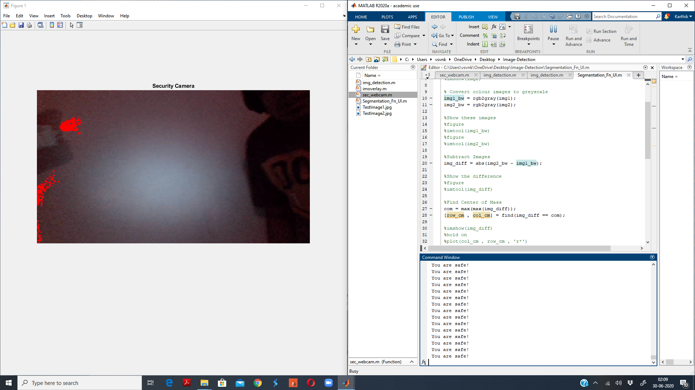
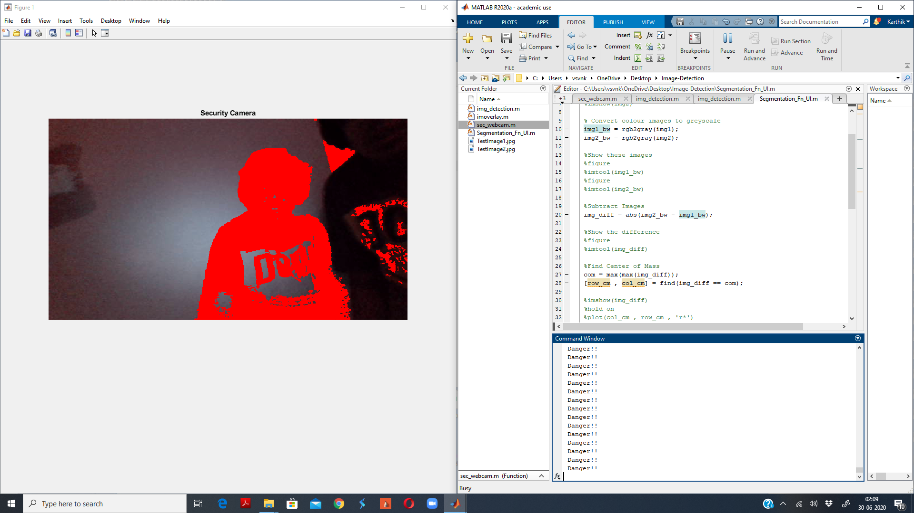

# Theft-detection
A MATLAB based image processor designed to notice abnormal movements of humans in a static environment and alert using the console.

## Contributor(s)
Karthik Viswanathan

## Requirements

1. MATLAB R2020a
2. Image Processing Toolbox
3. Machine Learning Toolbox
4. Security Camera Hardware Add-on

## Usage
1. Clone the repository.
2. Enter the following commands:

```bash
cd theft-detection/
cd app/
```
3. Open the MATLAB shell and execute the command below:

```matlab
sec_webcam
```

## Images

### 1. Initial Environmet



### 2. Danger



## Extended Descreption

Please feel free to contact/open an issue in case of any abnormalities found.
